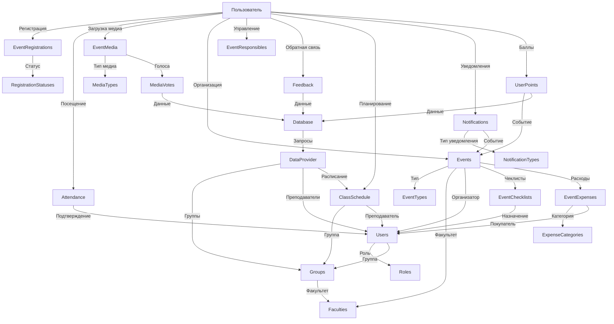

## Схема базы данных

1. #### Пользователи и их роли

Это основа приложения. Здесь определено, кто может пользоваться системой.

`Users` (Пользователи): Центральная таблица. Хранит информацию о студентах, преподавателях и администраторах.
`Roles` (Роли): Справочник ролей (`Студент`, `Организатор`, `Администратор`). Связан с `Users` через `RoleID`.
`Faculties` (Факультеты) и `Groups` (Группы): Определяют структуру колледжа. Таблица `Users` связана с `Groups`, а `Groups` — с `Faculties`.
Это позволяет фильтровать мероприятия и статистику по факультетам и группам.
- `Взаимодействие: Users <- Roles (Кто этот пользователь?) Users <- Groups <- Faculties (К какому факультету/группе он относится?)`

2. #### Календарь и планирование мероприятий

Эта часть отвечает за создание и описание событий.

`Events` (Мероприятия): Главная таблица для всех событий. Содержит название, описание, время, место и т.д.
`OrganizerID` связывает мероприятие с создателем (`Users`).
`TypeID` связывает с `EventTypes` (справочник типов: Конференция, Спорт, Праздник).
`FacultyID` (необязательно) связывает с `Faculties`, если это факультетское мероприятие.
- `Взаимодействие: Events <- Users (Кто организатор?) Events <- EventTypes (Какой тип мероприятия?) Events <- Faculties (Для какого факультета?)`

3. #### Регистрация и учет участников

Эта группа таблиц реализует систему регистрации и отметки присутствующих.

`EventRegistrations` (Регистрации на мероприятия): Связующее звено между пользователями и событиями. Когда студент нажимает "Участвовать", здесь создается запись.
Связана с `Events` (на что регистрируемся?) и `Users` (кто регистрируется?).
`StatusID` указывает на статус (Подтверждено, В листе ожидания) из таблицы `RegistrationStatuses`.
`QRCode` — здесь хранится уникальный код для быстрой отметки.
`Attendance` (Посещаемость): Фиксирует фактическое присутствие.
Создается запись, когда QR-код сканируется на входе. Связана с `EventRegistrations`.
`Feedback` (Обратная связь): После мероприятия участник может оставить отзыв. Таблица связана с `EventRegistrations`.
- `Взаимодействие: Users -> EventRegistrations <- Events (Кто на какое событие записался?) EventRegistrations -> Attendance (Кто из записавшихся пришел?) EventRegistrations -> Feedback (Кто оставил отзыв?)`

4. #### Планировщик задач для организаторов

Эти таблицы помогают организаторам управлять подготовкой к мероприятию.

`EventResponsibles` (Ответственные): Назначает ответственных за конкретные задачи (например, "Иванов Иван - отвечает за звук"). Связывает `Events` и `Users`.
`EventChecklists` (Чек-листы): Список дел для мероприятия ("Привезти микрофоны", "Надуть шарики"). Связан с `Events` и может быть назначен на конкретного `Users`.
`EventExpenses` (Расходы): Учет бюджета. Каждая трата привязывается к `Events` и к `Users` (кто потратил).
- `Взаимодействие: Все три таблицы (EventResponsibles, EventChecklists, EventExpenses) напрямую связаны с таблицей Events, расширяя её функционал для организаторов.`

5. #### Фото/видео архив и рейтинговая система

Эти функции повышают вовлеченность студентов.

`EventMedia` (Медиафайлы): Хранит ссылки на фото и видео.
Связана с `Events` (к какому событию относится?) и `Users` (кто загрузил?).
`MediaVotes` (Голоса за медиа): Позволяет пользователям голосовать за лучшие фото. Связывает `EventMedia` и `Users`.
`UserPoints` (Баллы пользователей): Реализует рейтинговую систему.
Баллы начисляются `Users` за участие в `Events`.
- `Взаимодействие: EventMedia <- Events (Фотографии с какого события?) Users -> MediaVotes <- EventMedia (Кто за какое фото проголосовал?) Users <- UserPoints -> Events (Кто за какое событие получил баллы?)`
